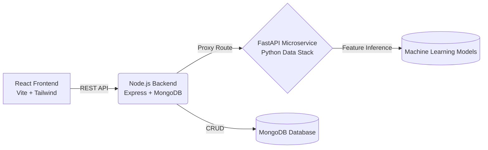

<div align="center">
  
  <h1>Agentic Customer Analytics Platform</h1>
  <p><strong>A Full-Stack AI System for Dynamic Customer Segmentation and Marketing Intelligence</strong></p>

  <!-- Badges -->
  <p>
    
    
    
    
    
  </p>
</div>

---

## 🚀 Overview

The **Agentic Customer Analytics Platform** is a scalable, AI-driven dashboard designed to help e-commerce businesses proactively manage customer retention. By continuously analyzing purchasing behavior and natural language feedback, the platform categorizes customers into dynamic personas and provides explainable, actionable marketing strategies.

This platform bridges the gap between raw data engineering and executive decision-making, offering a production-ready interface backed by complex data science modeling.

---

## ✨ Key Features

- 📊 **Executive Dashboard**: Real-time metrics on Customer Lifetime Value (CLV), segment distribution, and estimated revenue impact.
- 🎯 **Dynamic Segmentation**: Automatically groups users into highly targeted marketing personas based on Recency, Frequency, Monetary (RFM) metrics and NLP sentiment analysis.
- 🤖 **Agentic Decision Policy**: An intelligent recommendation engine that assigns the mathematically optimal marketing action (e.g., Discount, Win-Back Campaign, Loyalty Reward) to specific customer cohorts.
- 🔍 **Explainable AI (XAI)**: Demystifies AI recommendations with a live mathematical breakdown. Click any decision to view a beautiful waterfall chart illustrating the "Feature Importance" (SHAP value equivalents) driving the AI's logic.
- ✉️ **Marketing Studio**: Seamlessly generate personalized, targeted messaging templates for any customer segment.

---

## 🏗️ System Architecture

The platform utilizes a modern microservices-inspired architecture, decoupling the heavy data science workloads from the high-performance user interface.



---

## 💻 Technology Stack

### **Frontend Interface**
*   **Framework**: React 19 (Vite)
*   **Styling**: Tailwind CSS v4
*   **Data Visualization**: Recharts
*   **Icons & Animation**: Lucide React, Framer Motion

### **Backend Services**
*   **Primary Server**: Node.js & Express.js
*   **Database**: MongoDB (Mongoose ODM)
*   **Authentication**: JWT & bcryptjs

### **AI & Data Science (Microservice)**
*   **Server**: Python & FastAPI (Uvicorn)
*   **Data Processing**: Pandas, Scikit-Learn
*   **Validation**: Pydantic

---

## 📁 Repository Structure

```text
├── backend/                # Node.js Express server, auth, and MongoDB models
├── frontend/               # React application, Tailwind configs, and React Router
├── model_api/              # Python FastAPI microservice for XAI features
├── notebooks/              # Jupyter notebooks for data cleaning and model training
└── outputs/                # Generated data artifacts and LLM message outputs
```

---

## ⚙️ Getting Started

### Prerequisites
- Node.js (v18 or higher)
- Python (3.9 or higher)
- MongoDB running locally or via Atlas

### 1. Launch the Backend API
```bash
cd backend
npm install
npm run dev
```

### 2. Launch the Python AI Microservice
```bash
cd model_api
pip install -r requirements.txt
uvicorn main:app --host 0.0.0.0 --port 8000
```

### 3. Launch the Frontend Application
```bash
cd frontend
npm install
npm run dev
```
Open your browser to `http://localhost:5173` to view the application.

---
*Built with ❤️ for advanced customer intelligence.*
